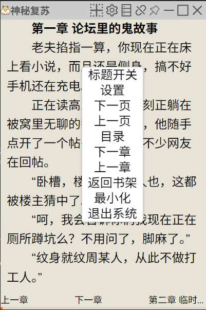
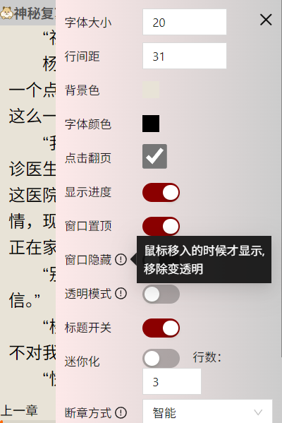
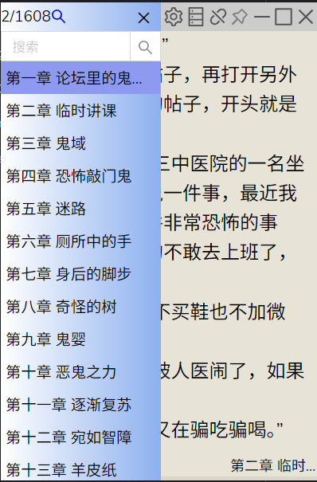
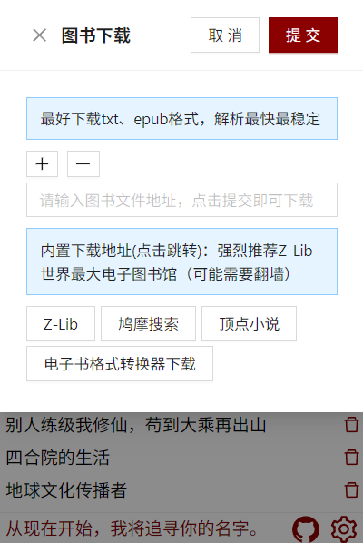

# 1、introduction

A mysterious e-book reader

You can use a computer in any setting, whether it's for work or school, as long as you have it. It's highly concealed and difficult to detect

Suitable for Windows, iOS, Linux (IOS needs to skip mandatory signature to use)

Supports e-book formats such as txt, epub, mobi, azw3, azw, docx, dox, pdf, html, htmlz, etc

The time required for non txt epub file formats may be relatively long (especially for mobi files around 10MB, which is particularly slow as the file size increases). If you spend a long time spinning around, you should find an online file format to convert to epub file and then operate again

ps:
    Slow is likely due to the author being too poor to afford the cloud server fees  o(╥﹏╥)o!

# 2、feature

- Transparent reading mode
- Hidden mode
- App Top mode
- Automatic directory extraction
- Many ways to Add file
- Delete files
- Custom setting And The functions that an e-book reader should have

# 3、download

[click to download app](https://github.com/lbk-ones/wd-reader/releases)

# 4、acknowledgments
thanks wails ! expectation wails V3 release

# 5、env
go 1.21 - 1.22 